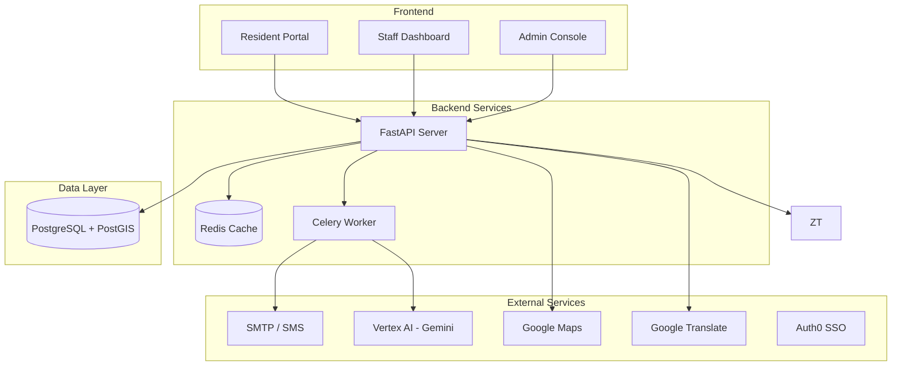
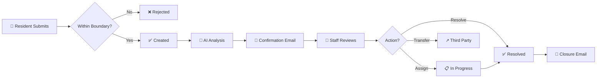
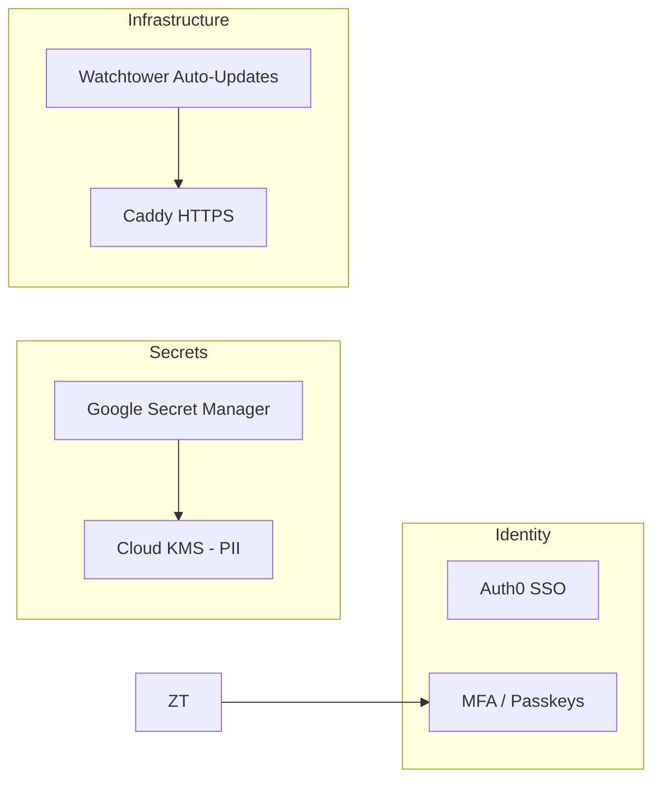

# Pinpoint 311 - Advanced Municipal Request System

<p align="center">
  
  
  
  
  
  
</p>

<p align="center">
  <a href="https://github.com/WestWindsorForward/WWF-Open-Source-311-Template/actions/workflows/build-publish.yml"></a>
  <a href="https://github.com/WestWindsorForward/WWF-Open-Source-311-Template/actions/workflows/codeql.yml"></a>
  <a href="https://github.com/WestWindsorForward/WWF-Open-Source-311-Template/actions/workflows/security-scan.yml"></a>
</p>

## 🏛️ Introduction

Pinpoint 311 is a production-grade, open-source platform designed for modern municipalities. It replaces legacy, clunky government forms with a **consumer-grade user experience** that feels as polished as a ride-sharing or food-delivery app.

Beyond the UI, it features a sophisticated **AI & Geospatial Engine** that automates triage, detects duplicate reports, and routes requests based on precise location data—saving thousands of staff hours manually sorting tickets.

---

## 🎭 Choose Your Experience

<table>
<tr>
<td width="25%" align="center">

### 🏠 Resident
**Report issues in 60 seconds**

✅ No account needed<br>
✅ 130+ languages<br>
✅ Track via magic link<br>
✅ Photo uploads

<a href="#-resident-portal-features">→ Features</a>

</td>
<td width="25%" align="center">

### 👷 Staff
**Manage & resolve requests**

✅ AI-powered triage<br>
✅ Priority scoring<br>
✅ Department routing<br>
✅ Internal comments

<a href="#-staff-dashboard-features">→ Features</a>

</td>
<td width="25%" align="center">

### ⚙️ Admin
**Configure everything**

✅ Service categories<br>
✅ Custom branding<br>
✅ API key management<br>
✅ User & role control

<a href="#️-admin-console-features">→ Features</a>

</td>
<td width="25%" align="center">

### 🔬 Researcher
**Analyze municipal data**

✅ 60+ research fields<br>
✅ Privacy-preserved<br>
✅ CSV & GeoJSON export<br>
✅ Census integration

<a href="#-research-suite-university-lab-integration">→ Features</a>

</td>
</tr>
</table>

<details>
<summary><b>📊 System Architecture</b> (click to expand)</summary>



</details>

<details>
<summary><b>🔄 Request Lifecycle</b> (click to expand)</summary>



</details>

<details>
<summary><b>🔐 Security Stack</b> (click to expand)</summary>



</details>

## 🌟 Core Features Overview

### 🎨 User Experience First
- **Premium Glassmorphism Design**: A modern, translucent UI that builds trust and engagement.
- **Mobile-First Architecture**: Fully responsive web app that behaves natively on iOS/Android.
- **130+ Language Support**: Powered by Google Translate API with intelligent caching. **Complete translation coverage**: UI strings, service categories, status labels, filter buttons, priority levels, search placeholders, and user-submitted content are automatically translated. **Automatic notification translation**: All confirmation emails and SMS messages are sent in the resident's selected language—no additional configuration needed.
- **No-Login Submission**: Removes friction for residents while maintaining security via email magic links.

### 🧠 Advanced Intelligence
- **Information Redaction**: Automatically strips PII (names, phones, emails) from public request logs.
- **Visual Analysis**: Uses **Gemini 3.0 Flash** via Google Cloud **Vertex AI** to "see" uploaded photos and categorize hazards (e.g., "pothole caused by water damage").
- **Multilingual AI Analysis**: When residents submit requests in non-English languages, the AI automatically provides a literal English translation first before performing its analysis, ensuring staff can understand all submissions regardless of language.
- **Priority Scoring (Human-in-the-Loop)**: AI suggests a 1-10 urgency score, but scores are **never automatically saved**. Staff must explicitly accept or override the AI suggestion, ensuring human accountability for all priority decisions.

### 🗺️ Geospatial Power
- **Asset Matching**: snaps user pins to verified infrastructure (e.g., streetlights, hydrants) using PostGIS `ST_DWithin`.
- **Boundary Enforcement**: Validates that requests are actually within township limits before submission.
- **Heatmaps & Clustering**: Auto-groups nearby requests to visualize problem hotspots.

---

## 🏠 Resident Portal Features

The Resident Portal is the public face of the system, designed for zero friction.

### 1. Service Discovery
- **Visual Grid**: Services are displayed with clear, consistent iconography (Lucide React) for instant recognition.
- **Service Categories**: Browsable catalog of all available township services.

### 2. Intelligent Location Picker
- **Interactive Map**: Google Maps integration with drag-to-set pin functionality.
- **Address Autocomplete**: Type-ahead search for local addresses.
- **Jurisdiction Boundaries**: System-level polygons (GeoJSON) define the valid service area. PINS dropped outside are auto-rejected.
- **Asset Integration**: Requests can be linked to specific infrastructure assets (e.g., specific park zones) if configured.

### 3. Advanced Routing Logic
- **Road-Based Routing**: Configurable rules for state/county roads.
    - *Example*: Potholes on "Route 1" are automatically blocked with a custom message: "This road is maintained by the State DOT. Please call 555-0199."
- **Third-Party Hand-off**: Services managed by private contractors (e.g., Waste Management) show specific contact info instead of a generic form.

### 4. Submission & Tracking
- **Multi-Photo Upload**: Supports up to 3 high-res images with client-side compression.
- **Magic Link Tracking**: Users receive a unique, hash-based tracking link (e.g., `/track/req-123`) to view live status updates without creating an account.
- **Status Timeline**: clean visualization of the request journey from "Received" → "In Progress" → "Resolved" → "Closed".
- **Public Request Map**: Interactive map allowing residents to view all open and resolved requests. Features robust filtering by:
    - **Department** (Police, Public Works, etc.)
    - **Status** (Open, Closed, In Progress)
    - **Date Range**
    - **Service Type**

---

## 👷 Staff Dashboard Features

The Staff Dashboard is the command center for municipal operations, protected by secure JWT authentication.

### 1. Unified Workspace
- **Live Feed**: Auto-refreshes every 30s; identifying "NEW" requests with badging.
- **Split-Pane View**: Independent scrolling for the request list and details panel.
- **Interactive Map**: Features "Satellite View" for precise location verification. Includes comprehensive filters for:
    - **Priority Level** (Critical, High, Normal)
    - **Department & Assigned Staff**
    - **Status & Date Range**
    - **Service Category**

### 2. Collaboration Tools
- **Internal Comments**: Private staff-only notes for coordination.
- **External Updates**: Public comments visible to residents via the tracker.
- **Staff Preferences**: Each staff member can toggle their own SMS/Email notifications.
- **Audit Log**: Immutable history of every action (status change, assignment, comment).

### 3. Request Management
- **Smart Assignment**: Auto-route to specific departments or keep in a general queue.
- **Completion Types**: Close requests as **Resolved** (with photo proof), **No Action Needed** (invalid), or **Transferred** (third-party).
- **Priority Override**: Manually escalate issues that AI might have missed.
- **Asset History**: When viewing a request attached to a physical asset (e.g., Hydrant #404), automatically shows all past history for that specific asset.
- **Status Workflow**:
    - **Open**: New request.
    - **In Progress**: Staff acknowledged and working.
    - **Resolved**: Work complete.
    - **Closed**: Final state (includes optional "Completion Photo" proof).

### 4. AI Insights Panel (Vertex AI Powered)
- **Safety Flags**: Highlights potential liabilities (e.g., "Downed power line detected").
- **Proximity Analysis**: Checks if the issue is near critical infrastructure (Schools, Hospitals, Fire Stations) via PostGIS, with a **Nominatim (OpenStreetMap)** fallback for unmapped areas.
- **Sentiment Analysis**: Gauges the tone of the resident's description (Neutral, Frustrated, Urgent).
- **Weather Context**: Automatically fetches real-time weather (e.g., "Heavy Rain, 45°F") to validiate hazards.
- **Gemini 3.0 Flash**: Powered by Google's latest model with "Thinking Config" for deep reasoning and lower latency.
- **Duplicate Detection**: Suggests potential duplicate reports based on location (within 50m) and time window.
- **Human-in-the-Loop Priority**: AI priority suggestions are stored in a JSON field and displayed with an **"Accept AI Priority"** button. Staff must explicitly accept the score before it becomes the official priority, creating a complete audit trail.
- **PostGIS Geospatial Analytics**:
    - **Hotspot Analysis**: Automatically clusters requests to identify problem areas (e.g., "Pothole Clusters" on specific roads).
    - **User Bias Detection**: Flags suspicious activity using spatial statistics (e.g., single user spamming requests in a 10m radius).
    - **Jurisdiction Verification**: Real-time point-in-polygon checks against township boundaries.

---

## ⚙️ Admin Console Features

A full CMS for managing the municipality's presence without touching code.

- **Custom Icons**: Select from a library of 100+ icons.
- **Routing Rules**: Assign services to specific departments (e.g., "Potholes" → "DPW").
- **SLA Definitions**: Set expected response times (e.g., "24 hours" for urgent issues).

### 1. Service Configuration
- **Granular Routing**: Configure each service category (e.g., "Pothole") to:
    - **Township Handled**: Route to internal Public Works department.
    - **Third-Party Handoff**: Direct residents to external agencies (e.g., "This road is state-maintained, please call DOT at...").
    - **Road-Based Logic**: Automatically split jurisdiction based on specific street names (e.g., "Main St" goes to County, "Elm St" stays local).
- **Custom Questions**: specific follow-up questions (e.g., "Is the dog aggressive?") for each service category to gather precise details.

### 2. System Management
- **System Updates**: One-click "Pull Updates" to fetch the latest code from GitHub and rebuild containers.
- **Custom Map Layers**: Upload **GeoJSON** files to visualize township assets (Parks, Storm Drains, Zoning Districts) directly on the staff map.
- **Domain Configuration**: Automatic HTTPS provisioning via Caddy (Let's Encrypt) for custom domains.
- **Key Management**: Securely store API keys for Google Maps, Vertex AI (Google Cloud Project ID + Service Account Key), and SMS Providers.
- **Feature Modules**: Toggle major features like "AI Analysis" or "SMS Alerts" on/off globally.
    - `ENABLE_SMS_ALERTS`: Toggle text message notifications (Twilio or Generic).
- **Database Maintenance**: Tools to seed default data or flush test records.

---

## 📊 Research Suite (University Lab Integration)

A privacy-preserving analytics layer designed for external university researchers studying municipal operations, infrastructure, equity, and civic engagement. Exports **60+ research fields** computed on-the-fly from **real data sources**.

### Access Control
- **Researcher Role**: Dedicated user role with read-only access to sanitized data
- **Admin Toggle**: Enable/disable via Admin Console → Modules → Research Portal
- **Audit Logging**: All data access is logged for governance compliance

### Data Exports
Two export formats optimized for different research toolchains:

| Format | Use Case | Tools |
|--------|----------|-------|
| **CSV** | Statistical analysis | Python (pandas), R, SPSS, Excel |
| **GeoJSON** | Spatial analysis | QGIS, ArcGIS, GeoPandas, Mapbox |

### Privacy Preservation
All exports are designed to protect resident privacy while enabling meaningful research:

- **PII Redaction**: Phone numbers, emails, and names are masked in descriptions
- **Address Anonymization**: House numbers removed, street names preserved (e.g., "123 Main St" → "Main Street (Block)")
- **Location Fuzzing**: Coordinates snapped to ~100ft grid (default) or exact (admin only)
- **Zone IDs**: Anonymous geographic zones (~0.5 mile cells) for clustering without revealing exact locations

---

### 📦 Research Packs (5 Specialized Domains)

#### 🟣 Social Equity Pack (Sociologists)
Real census data integration for equity research.

| Field | Type | Description | Source |
|-------|------|-------------|--------|
| `census_tract_geoid` | string | 11-digit FIPS code for Census joins | US Census Geocoder API ✅ |
| `social_vulnerability_index` | float (0-1) | CDC SVI (0=lowest, 1=highest) | Derived from GEOID |
| `housing_tenure_renter_pct` | float (0-1) | Renter percentage in zone | Derived from GEOID |
| `income_quintile` | int (1-5) | Anonymized income quintile | Zone-based proxy |
| `population_density` | string | low/medium/high category | Zone-based proxy |

**Suggested Analyses**: Census ACS demographic correlation, SVI vs response time regression, renter vs owner reporting rates

---

#### 🔵 Environmental Context Pack (Urban Planners)
Real historical weather data and infrastructure lifecycle analysis.

| Field | Type | Description | Source |
|-------|------|-------------|--------|
| `weather_precip_24h_mm` | float | Precipitation 24h before report | Open-Meteo Archive API ✅ |
| `weather_temp_max_c` | float | Max temperature on report day | Open-Meteo Archive API ✅ |
| `weather_temp_min_c` | float | Min temperature on report day | Open-Meteo Archive API ✅ |
| `weather_code` | int | WMO weather code (61=rain, 71=snow) | Open-Meteo Archive API ✅ |
| `nearby_asset_age_years` | float | Age of matched infrastructure | Asset properties |
| `matched_asset_attributes` | JSON | Full asset properties (pressure_psi, acres, bulb type) | GeoJSON layer ✅ |
| `season` | string | winter/spring/summer/fall | Calculated |

**Suggested Analyses**: Freeze-thaw pothole correlation, asset survival analysis, precipitation-drainage linkage

---

#### 🩷 Sentiment & Trust Pack (Political Scientists)
NLP-derived indicators of civic trust and satisfaction.

| Field | Type | Description | Source |
|-------|------|-------------|--------|
| `sentiment_score` | float (-1 to +1) | NLP sentiment (-1=angry, +1=grateful) | Word-based NLP ✅ |
| `is_repeat_report` | boolean | Text indicates prior report of same issue | Regex detection ✅ |
| `prior_report_mentioned` | boolean | References ticket/case number | Regex detection ✅ |
| `frustration_expressed` | boolean | Trust erosion indicators present | Regex detection ✅ |

**Suggested Analyses**: Sentiment vs income quintile, repeat report resolution rates, trust erosion over time

---

#### 🟠 Bureaucratic Friction Pack (Public Administration)
Quantified measures of administrative efficiency and government responsiveness.

| Field | Type | Description | Source |
|-------|------|-------------|--------|
| `time_to_triage_hours` | float | Hours from submission to first "In Progress" | Audit logs ✅ |
| `reassignment_count` | int | Times request bounced between departments | Audit logs ✅ |
| `off_hours_submission` | boolean | Submitted before 6am or after 10pm | Timestamp ✅ |
| `escalation_occurred` | boolean | Priority manually increased by staff | Audit logs ✅ |
| `total_hours_to_resolve` | float | Total clock hours to closure | Calculated ✅ |
| `business_hours_to_resolve` | float | Business hours only (Mon-Fri 8am-5pm) | Calculated ✅ |
| `days_to_first_update` | float | Days until first staff action | Calculated ✅ |
| `status_change_count` | int | Number of status changes | Audit logs ✅ |

**Suggested Analyses**: Triage time vs resolution outcome, department routing efficiency, off-hours urgent patterns

---

#### 🟢 AI/ML Research Pack (Data Scientists)
Training data for AI systems and human-AI alignment studies.

| Field | Type | Description | Source |
|-------|------|-------------|--------|
| `ai_flagged` | boolean | AI flagged for staff review | Vertex AI ✅ |
| `ai_flag_reason` | string | Reason for flag (safety, urgent) | Vertex AI ✅ |
| `ai_priority_score` | float (1-10) | AI-generated priority | Vertex AI ✅ |
| `ai_classification` | string | AI-assigned category | Vertex AI ✅ |
| `ai_summary_sanitized` | string | AI summary (PII redacted) | Vertex AI ✅ |
| `ai_analyzed` | boolean | Whether AI processed this request | System ✅ |
| `ai_vs_manual_priority_diff` | float | manual_priority - ai_priority | Calculated ✅ |

**Suggested Analyses**: AI-human priority alignment, flagging accuracy, classification accuracy studies

---

### Real-Time Data Sources
All research fields are computed on-the-fly using real APIs:

| Source | Fields | Notes |
|--------|--------|-------|
| **US Census Bureau Geocoder** | census_tract_geoid | Free, no API key required |
| **Open-Meteo Archive API** | weather_* fields | Free historical weather data |
| **NLP Analysis** | sentiment_score, trust indicators | Word-based sentiment analysis |
| **Audit Logs** | bureaucratic friction fields | Real system data |
| **Vertex AI** | ai_* fields | If AI analysis is enabled |

### API Endpoints
| Endpoint | Description |
|----------|-------------|
| `GET /api/research/status` | Check if Research Suite is enabled |
| `GET /api/research/analytics` | Aggregate statistics and distributions |
| `GET /api/research/export/csv` | Download sanitized CSV with all 60+ fields |
| `GET /api/research/export/geojson` | Download GeoJSON for GIS analysis |
| `GET /api/research/data-dictionary` | Complete field documentation for academic papers |
| `GET /api/research/code-snippets` | Python & R code examples |

---

## 🚀 Technical Architecture

### Communication Engine
- **Branding Engine**: Automatically injects township logo, colors, and font settings into every email.
- **Rich SMS**: Sends text alerts with status emojis (✅, 🚧), request details (category, address), and magic links for instant tracking.
- **Provider Agnostic**: Built-in support for **Twilio**, plus a generic HTTP adapter for any other SMS gateway.
- **Completion Proof**: "Review & Close" workflow attaches the final resolution photo to the closing email sent to the resident.

### Standards Compliance
- **Open311 v2**: Fully compliant with the Open311 GeoReport v2 standard (JSON).
    - `GET /requests.json`: Public feed (cached via Redis).
    - `POST /requests.json`: Standard submission endpoint.
- **Audit Trails**: Every action (submission, comment, status change) is logged for accountability.

### Tech Stack
| Component | Technology | Description |
|-----------|------------|-------------|
| **Frontend** | React 18 + TypeScript | Performant, type-safe UI built with Vite |
| **Styling** | Tailwind CSS + Framer Motion | Fluid animations and glassmorphism themes |
| **Backend** | FastAPI (Python 3.11) | High-performance async REST API |
| **Database** | PostgreSQL 15 + PostGIS | Relational data with advanced spatial queries |
| **Caching** | Redis | High-speed caching for public request feeds (60s TTL) |
| **AI** | Vertex AI (Gemini Flash) | Multimodal model for image/text analysis |
| **Queue** | Celery + Redis | Background processing for emails and reports |
| **Reverse Proxy** | Caddy | Automatic HTTPS and SSL termination |

### 🔒 Security Standards

#### Enterprise Security Stack
Pinpoint 311 implements a production-grade security stack with managed cloud services:

| Component | Purpose | Provider |
|-----------|---------|----------|
| **Auth0** | SSO with MFA & Passkeys | Managed Identity |
| **Google Secret Manager** | API keys & credentials | Google Cloud |
| **Google Cloud KMS** | Resident PII encryption | Google Cloud |
| **Watchtower** | Container auto-updates | Self-hosted |

#### Zero-Password Authentication
Staff login via **Auth0** with enterprise-grade security:
- **Multi-Factor Authentication**: TOTP, passkeys, and biometric support
- **Social Login**: Google, Microsoft, and other identity providers
- **Passwordless Option**: WebAuthn/passkeys for phishing resistance
- **No passwords stored**: Authentication fully delegated to Auth0

#### Secrets Management
Two-tier security for credentials:

| Secret Type | Storage | Encryption |
|-------------|---------|------------|
| API Keys (SMTP, SMS, Maps) | Google Secret Manager | Google-managed HSMs |
| Resident PII (email, phone, name) | PostgreSQL | Google Cloud KMS (AES-256) |
| Local Development | Encrypted Database | Fernet (AES-128-CBC) |

#### Container Auto-Updates
**Watchtower** automatically pulls and deploys security updates:
- Updates at 3am daily (configurable)
- Rolling restarts for zero downtime
- Applies to all containers (PostgreSQL, Redis, Caddy)

#### Legacy Encryption Support
For local development without GCP, Fernet encryption provides fallback:
- **Algorithm**: Fernet (AES-128-CBC with HMAC-SHA256)
- **Key Derivation**: PBKDF2 from `SECRET_KEY` environment variable
- **Automatic migration**: Plain text values encrypted on first update

#### API & Infrastructure Security
- **Rate Limiting**: 500 requests/minute per IP (slowapi)
- **Security Headers**: X-Frame-Options, CSP, nosniff, XSS protection
- **RBAC**: Staff, Researcher, Admin roles with JWT authentication
- **Input Validation**: Pydantic schemas, SQLAlchemy ORM (SQL injection proof)
- **Audit Logging**: Immutable trail of all request lifecycle events

For full security details, see [COMPLIANCE.md](./COMPLIANCE.md).

#### Vertex AI Security
| Feature | Protection |
|---------|------------|
| Data Residency | Stays within configured GCP region |
| Encryption | TLS 1.3+ in transit, AES-256 at rest |
| No Data Training | Customer data NOT used for training |
| Certifications | SOC 1/2/3, ISO 27001, FedRAMP, HIPAA |
| Human-in-the-Loop | AI suggestions require staff approval |

### 📋 Document Retention Engine

State-specific record retention with legal hold protection:
- **Built-in policies**: TX (10yr), NJ/PA/WI (7yr), NY/MI/WA (6yr), CA/FL/others (3-5yr)
- **Admin-configurable**: Select state or custom period
- **Automatic enforcement**: Daily Celery task archives expired records

### ♿ Accessibility (WCAG 2.2 AA)

Full keyboard navigation, 4.5:1 contrast ratio, proper aria-labels on all interactive elements. See [COMPLIANCE.md](./COMPLIANCE.md) for details.

---

## 📦 Deployment & Setup

### CI/CD Pipeline

Pinpoint 311 uses GitHub Actions for automated builds and security scanning:

| Workflow | Trigger | Purpose |
|----------|---------|---------|
| **Build & Publish** | Push to main | Multi-arch Docker images to GHCR |
| **CodeQL** | Push/PR + weekly | Static security analysis (Python/JS) |
| **Security Scan** | Push + weekly | OWASP ZAP + Trivy vulnerability scanning |
| **Uptime Monitor** | Every 15 min | Health checks with auto-alerting |
| **Dependabot** | Weekly | Automatic dependency updates |

### Docker Images

Pre-built images available on GitHub Container Registry:
```bash
ghcr.io/westwindsorforward/wwf-311-backend:latest
ghcr.io/westwindsorforward/wwf-311-frontend:latest
```

Supports both `linux/amd64` and `linux/arm64` architectures.

### Production Deployment (Recommended)

```bash
# Pull prebuilt images and deploy
docker compose -f docker-compose.yml -f docker-compose.prod.yml pull
docker compose -f docker-compose.yml -f docker-compose.prod.yml up -d
```

### Development Deployment

```bash
# Build locally (slower, for development only)
docker compose up --build -d
```

### Prerequisites
- Docker & Docker Compose
- A Google Cloud Project (for Maps & Vertex AI)

### Quick Start
```bash
# 1. Clone the repository
git clone https://github.com/WestWindsorForward/WWF-Open-Source-311-Template.git
cd WWF-Open-Source-311-Template

# 2. Configure Environment
cp .env.example .env
# Edit .env and set your secrets (DB_PASSWORD, SECRET_KEY, etc.)

# 3. Launch
docker-compose up --build -d
```

### Access Points
- **Resident Portal**: `http://localhost/`
- **Staff Dashboard**: `http://localhost/staff`
- **Admin Console**: `http://localhost/admin`
- **Research Lab**: `http://localhost/research` *(requires researcher role)*
- **API Documentation**: `http://localhost/api/docs`

### Default Credentials
user: `admin` | password: `admin123`

*(You will be prompted to change this immediately upon login)*

---

## 🤝 Contributing

We welcome contributions from developers and public servants!
1.  Fork the repo
2.  Create a feature branch (`git checkout -b feature/AmazingFeature`)
3.  Commit your changes (`git commit -m 'Add some AmazingFeature'`)
4.  Push to the branch (`git push origin feature/AmazingFeature`)
5.  Open a Pull Request

---

<p align="center">
  Built with ❤️ for Civic Engagement
</p>
